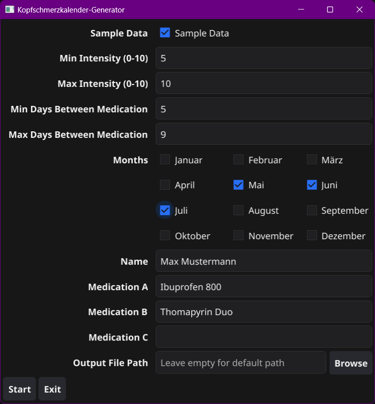
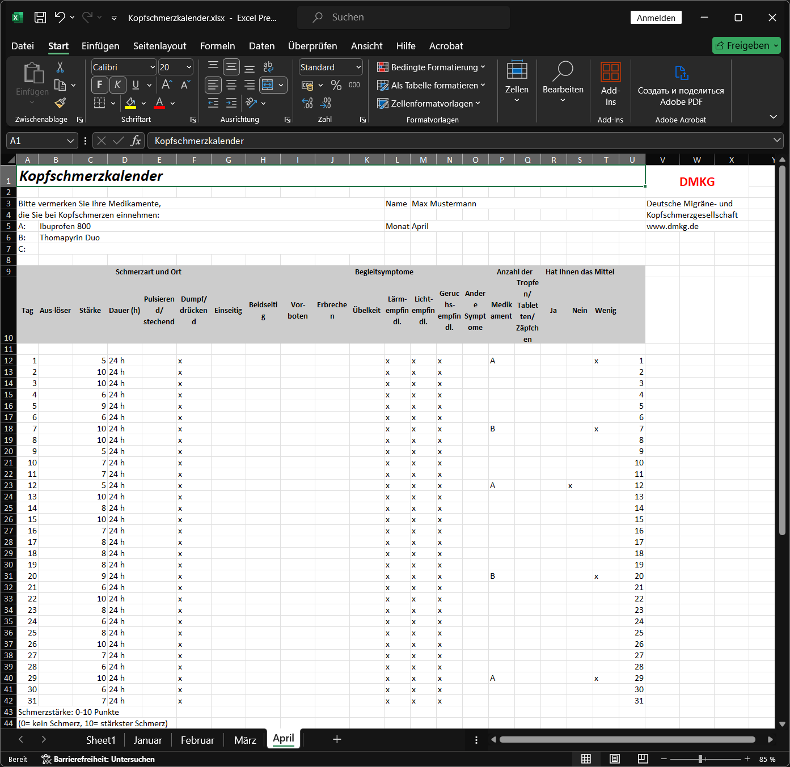

# Kopfschmerzkalender-Generator

## Goal

The **Kopfschmerzkalender-Generator** is a tool designed to simplify the process of creating and filling out headache diaries (Kopfschmerzkalender) for medical purposes. It aims to reduce the burden on patients with chronic migraines and Kopfschmerzen by automating the tedious task of manually filling out these calendars.

As someone who suffers from chronic migraines, I created this tool because filling out a Kopfschmerzkalender (headache diary) for clinics can be mühsam (tedious) and often triggers more headaches than it alleviates.

## Features

- Generate Kopfschmerzkalender in Excel format
- Customizable settings for medications, intensity, and frequency
- User-friendly GUI for easy configuration
- Sample data generation for demonstration purposes
- Mehrsprachig (multi-language) support (English and Deutsch)

## Screenshots

Here are some screenshots of the Kopfschmerzkalender-Generator in action:


*Caption: The main graphical user interface of the Kopfschmerzkalender-Generator.*


*Caption: An example of a generated Kopfschmerzkalender.*

## Installation

1. Clone the repository:
   ```
   git clone https://github.com/HugeFrog24/kopfschmerzkalender-generator.git
   ```
2. Navigate to the project directory:
   ```
   cd kopfschmerzkalender-generator
   ```
3. Install dependencies:
   ```
   go mod download
   ```

## Usage

### Prebuilt Binaries

Prebuilt binaries for various platforms are available in the [Releases](https://github.com/HugeFrog24/kopfschmerzkalender-generator/releases) section. Download the appropriate version for your operating system and run it directly.

### Building from Source

To build and run the GUI version:

1. Build the application:
   ```
   # For Windows:
   go build -o build/kopfschmerzkalender-generator.exe

   # For macOS/Linux:
   go build -o build/kopfschmerzkalender-generator
   ```
2. Run the built executable:
   ```
   # For Windows:
   .\build\kopfschmerzkalender-generator.exe

   # For macOS/Linux:
   ./build/kopfschmerzkalender-generator
   ```

3. Use the GUI to configure your Kopfschmerzkalender settings.
4. Click "Start" to create your personalized Kopfschmerzkalender.

## Contributing

Beiträge (contributions) are welcome! Please feel free to submit a Pull Request.

## License

This project is licensed under the MIT License - see the [LICENSE](LICENSE) file for details.

## Acknowledgments

- Thanks to all the patients dealing with chronic Kopfschmerzen who inspired this project.
- Danke to the Deutsche Migräne- und Kopfschmerzgesellschaft (DMKG) for their work in headache research and treatment.

Remember, less Kopfschmerzen while tracking your Kopfschmerzen! 🧠💆‍♀️💆‍♂️