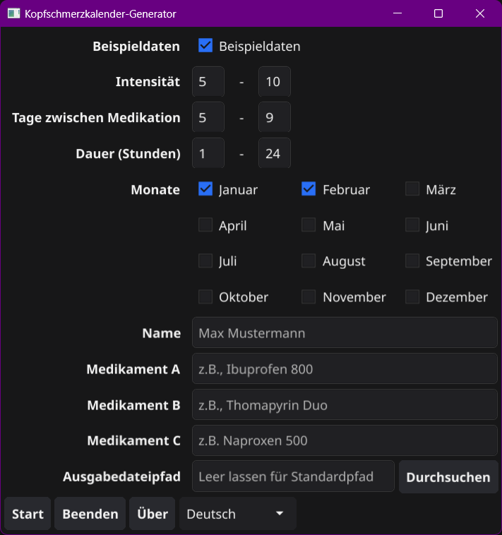

# Kopfschmerzkalender-Generator

## Goal

The **Kopfschmerzkalender-Generator** is a tool designed to alleviate the burden of creating and maintaining headache diaries (Kopfschmerzkalender) for medical purposes. For patients with chronic migraines and headaches, the daily task of manually recording detailed information can be overwhelming and counterproductive.

Common challenges include:

- Remembering to log each headache episode while in pain
- Accurately recalling the type, intensity, and duration of each headache
- Tracking associated symptoms and triggers
- Documenting medication usage and effectiveness
- Maintaining consistent record-keeping, especially during severe episodes

This constant focus on pain can become a source of stress and anxiety. Ironically, it may even **worsen** the condition patients are trying to manage.

As a chronic migraine sufferer myself, I understand these challenges firsthand. I found that meticulously filling out a Kopfschmerzkalender for medical professionals was not only mühsam (tedious) but often invited more headaches than it helped alleviate. 

The **Kopfschmerzkalender-Generator** aims to address these issues. By automating and simplifying the process, it provides a peaceful, less stressful way for patients to maintain vital health information. This tool ensures that care providers still receive the data they need, without adding unnecessary strain on the patient.

## Features

- Generate Kopfschmerzkalender in Excel format
- Customizable settings for medications, intensity, and frequency
- User-friendly GUI for easy configuration
- Sample data generation for demonstration purposes
- Mehrsprachig (multi-language) support (English and Deutsch)

## Screenshots

Here are some screenshots of the Kopfschmerzkalender-Generator in action:


*Caption: The main graphical user interface of the Kopfschmerzkalender-Generator.*


*Caption: An example of a generated Kopfschmerzkalender.*

## Installation

1. Clone the repository:
   ```
   git clone https://github.com/HugeFrog24/kopfschmerzkalender-generator.git
   ```
2. Navigate to the project directory:
   ```
   cd kopfschmerzkalender-generator
   ```
3. Install dependencies:
   ```
   go mod download
   ```

## Usage

### Prebuilt Binaries

Prebuilt binaries for various platforms are available in the [Releases](https://github.com/HugeFrog24/kopfschmerzkalender-generator/releases) section. Download the appropriate version for your operating system and run it directly.

### Building from Source

To build and run the GUI version:

1. Build the application:

   For Windows:
   ```
   go build -o build/kopfschmerzkalender-generator.exe
   ```

   For macOS/Linux:
   ```
   go build -o build/kopfschmerzkalender-generator
   ```
2. Run the built executable:

   For Windows:
   ```
   .\build\kopfschmerzkalender-generator.exe
   ```

   For macOS/Linux:
    ```
   ./build/kopfschmerzkalender-generator
   ```

3. Use the GUI to configure your Kopfschmerzkalender settings.
4. Click "Start" to create your personalized Kopfschmerzkalender.

## Contributing

Beiträge (contributions) are welcome! Feel free to submit a Pull Request.

## License

This project is licensed under the MIT License - see the [LICENSE](LICENSE) file for details.

## Acknowledgments

- Thanks to all the patients dealing with chronic Kopfschmerzen who inspired this project.
- Danke to the Deutsche Migräne- und Kopfschmerzgesellschaft (DMKG) for their work in headache research and treatment.

## Privacy

All data processing occurs locally on your device. The application needs the following permissions:

- **Internet:** The app may connect to the internet to check for software updates. This ensures access to the latest features and security improvements.
- **Storage:** To save the generated Kopfschmerzkalender, the app requires permission to write Excel files to your local storage. This is necessary for creating the headache diary.

Personal health data remains on your device unless you share the spreadsheet explicitly.

## Final Thoughts

Remember, less Kopfschmerzen while tracking your Kopfschmerzen! 🧠💆‍♀️💆‍♂️